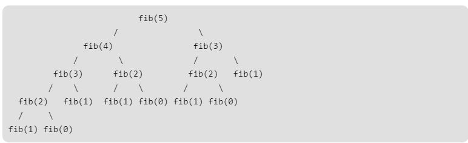
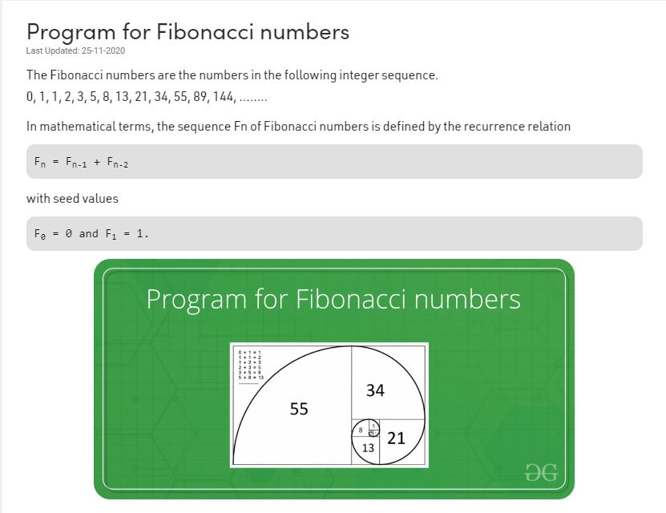

# <div align="center"> function <div>
## <div align="right">واجبات سيف بشار <div>
### <div align="leftt"> Exercises 5<div>
```` C++ 
Q1: Write a program that solve the following math series using functions 
𝑦=1−1/2!+ 1/3!− 1/4!+⋯… 1/𝑛!

`````
````c++
#include <iostream>
#include<math.h>
using namespace std;
int fact(int n) 
{
	if ((n == 0) || (n == 1))
		return 1;
	else
		return n * fact(n - 1);
}
void reslt()
{
	int number;
	double z, sum = 0.0, m;
	cout << "Enter any number : ";
	cin >> number;
	for (int i = 1; i <= number; i++)
	{
		m = fact(i);
		z = 1 / m;
		if (i % 2 == 0)
		{
			sum = sum - z;
		}
		else
		{
			sum = sum + z;
		}
	}
	cout << "Y = " << sum << "\n";
}
int main() 
{
	reslt();
	return 0;
}

`````
----------
```python
Q2: Write a program using function that count uppercase 
letters, in 20 letters entered by the user in the main function.
```

```C++

#include <iostream>
#include<math.h>
using namespace std;

void letters()
{
	char letter;
	int sum = 0;
	for (int i = 0; i < 20; i++)
	{
		cout << "The sum of all capital letters " << i + 1 << " : ";
		cin >> letter;
		if ((letter >= 'A') && (letter <= 'Z'))
		{
			sum = sum + 1;
		}
	}
	cout << "letter sum = " << sum << "\n";
}

int main() 
{
	letters();
	return 0;
}
````
------
````python

Q3: Write a program using function that reads two integers (feet and inches) representing distance, then convert this
 distance to meters.
1 foot = 12 inch
1 inch = 2.54 cm

`````
````C++

#include <iostream>
#include<math.h>
using namespace std;
void convert()
{
	float feet, inches, m_f, m_i;
	cout << "Enter any distance by feet = ";
	cin >> feet;
	cout << "Enter any distance by inches = ";
	cin >> inches;
	//1 foot = 0.3048 m
	//1 inches = 0.0254
	m_f = feet * 0.3048;
	m_i = inches * 0.0254;
	cout << "The distance from feet to meter = " << m_f << " m" << "\n";
	cout << "The distance from inches to meter = " << m_i << " m" << "\n";
}
int main() 
{
	convert();
	return 0;
}

````
-------
```Python
Q4: Write a program using function that reads an integer (T) representing time in seconds, then convert it to the 
 equivalent hours, minutes and seconds in this form: Hour : Minute : Second
`````
```C++
#include <iostream>
#include<math.h>
using namespace std;

void calculat(int T)
{
	int Hour, Minute, Second;
	Hour = T / 3600;
	Minute = (T % 3600) / 60;
	Second = (T % 3600) % 60;
	cout << Hour << " : " << Minute << " : " << Second << "\n";
}

int main() 
{
	int T;
	cout << "Enter time by second = ";
	cin >> T;
	calculat(T);

	return 0;
}


```
-----
```Python
Q5: Write a program using function to see if a number is an integer (odd or even) or not an integer
```
```C++
#include <iostream>
#include<math.h>
using namespace std;

void in_fl(float x)
{
	float z, c;
	int y;

	y = (int)x;
	c = pow(y, 2);
	z = pow(x, 2);

	if (z == c)
	{
		if (y % 2 == 0)
			cout << "The number is integer and even " << "\n";
		else
			cout << "The number integer and odd " << "\n";

	}
	else
		cout << "The number not integer " << "\n";
}

int main() 
{
	float x;
	cout << "Enter any number :";
	cin >> x;
	in_fl(x);

	return 0;
}

```
-----
```C++
Q6: Write a program using function to input student average and return:
4 if the average between 90-100
3 if the average between 80-89
2 if the average between 70-79
1 if the average between 60-69
0 if the average is lower than 60
```
````C++

#include <iostream>
#include<math.h>
using namespace std;

int average(float avg)
{
	if ((avg >= 90) && (avg <= 100))
		return 4;
	else if ((avg >= 80) && (avg <= 89))
		return 3;
	else if ((avg >= 70) && (avg <= 79))
		return 2;
	else if ((avg >= 60) && (avg <= 69))
		return 1;
	else if ((avg < 60))
		return 0;
	else
		return -1;
}

int main() 
{
	float avg;
	cout << "Enter student average : ";
	cin >> avg;
	cout << average(avg) << "\n";

	return 0;
}

`````
----
```Python

Q7: Write a program using function to find the permutation of n .
```

```C++
#include <iostream>
#include<math.h>
using namespace std;
int permutation(int n)
{
	if ((n == 0) || (n == 1))
		return 1;
	else
		return n * permutation(n - 1);
}
int main() 
{
	int n;
	cout << "Enter any number to find the permutation of number = ";
	cin >> n;
	cout << "The permutation " << n << " is = " << permutation(n) << "\n";
	
	return 0;
}

```
-----
````C++
Q8: Write a program using function to find the nth Fibonacci number

````
```C++
#include <iostream>
#include<math.h>
using namespace std;
//Fibonacci Series using Recursion 
int fib(int n)
{
	if (n <= 1)
		return n;
	else
		return fib(n - 1) + fib(n - 2);
}

int main() 
{
	int n = 9;
	cout << "the nth(9) Fibonacci number is = " << fib(n) << "\n";

	return 0;
}

```
<span style="background-color: red"> *or* </span>

> *Write a program using function to find the any Fibonacci number*
````C++
#include <iostream>
#include<math.h>
using namespace std;
//Fibonacci Series using Recursion 
int fib(int n)
{
	if (n <= 1)
		return n;
	else
		return fib(n - 1) + fib(n - 2);
}

int main() 
{
	int n;
	cout << "Enter to find  the any Fibonacci number = ";
	cin >> n;
	cout << "the Fibonacci number is = " << fib(n) << "\n";

	return 0;
}

````
<span style="background-color: red"> *or* </span>

> *Write a program using function to find the any Fibonacci number*
````C++
#include <iostream>
#include<math.h>
using namespace std;
//Fibonacci Series using Recursion 
int fib(int n)
{
	int a = 0, b = 1, c;
	for (int i = 2; i <= n; i++)
	{
		c = a + b;
		a = b;
		b = c;
	}
	return b;
}

int main() 
{
	int n;
	cout << "Enter to find  the any Fibonacci number = ";
	cin >> n;
	cout << "the Fibonacci number is = " << fib(n) << "\n";

	return 0;
}
`````
> <div align="right">صورة مهمة تشرح عمل الكود لايجاد رقم فيبوناتشي<div>

>> 

> <div align="right">صورة مهمة تشرح قانون الكود لايجاد رقم فيبوناتشي<div>

>> 

----
```C++
Q9: Write a program using function to calculate the factorial of an integer entered by the user in the main function
```
```C++
#include <iostream>
#include<math.h>
using namespace std;
 
int fact(int n)
{
	if ((n == 0) || (n == 1))
		return 1;
	else
		return n * fact(n - 1);
}

int main() 
{
	int number;
	cout << "Enter any number for find  factorial = ";
	cin >> number;
	cout << "factorial for " << number << " is = " << fact(number) << "\n";

	return 0;
}

```
----
```C++
Q10: Write a program using function to evaluate the following equation .
 𝑍= 𝑥!−𝑦!/(𝑥−𝑦)!
```
```C++
#include <iostream>
#include<math.h>
using namespace std;
 
int fact(int n)
{
	if ((n == 0) || (n == 1))
		return 1;
	else
		return n * fact(n - 1);
}

int main() 
{
	int number1, number2, x, y, z, w, q;
	cout << "Enter first the number = ";
	cin >> number1;
	cout << "Enter second the number = ";
	cin >> number2;
	if (number1 > number2)
	{
		x = fact(number1);
		y = fact(number2);
		w = number1 - number2;
		q = fact(w);
		z = (x - y) / q;
		cout << z;
	}
	else
		cout << "\ncannot be( Y ) greater than ( X ) because this yields a negative number and thus not factorial for it" << "\n";


	return 0;
}

```
----
```C++
Q11: Write a program using function to test the year if it is a leap year or not
```
```C++
#include <iostream>
#include<math.h>
using namespace std;

void leap_year(int year)
{
	if (year % 4 == 0)
		cout << "This year is leap year" << "\n";
	else
		cout << "This year not leap year" << "\n";
}
int main() 
{
	int year;
	cout << "Enter any year : ";
	cin >> year;
	leap_year(year);

	return 0;
}

```
----
```
Q12: Write a program using the method to find 𝑥^𝑦 .
```
```C++
#include <iostream>
#include<math.h>
using namespace std;

void pow_p()
{
	float x, y, z;
	cout << "Enter any number : ";
	cin >> x;
	cout << "Enter any number to be the strength of the first number you entered : ";
	cin >> y;
	z = pow(x, y);
	cout << "( " << x << " ) ^ " << y << " = " << z << "\n";
}

int main() 
{
	pow_p();

	return 0;
}

```
----
```
Q13: Write a program using function to reverse an integer number .
```
```C++
#include <iostream>
#include<math.h>
using namespace std;

void reverse()
{
    int n, reversedNumber = 0, remainder;

    cout << "Enter an integer: ";
    cin >> n;

    while (n != 0)
    {
        remainder = n % 10;
        reversedNumber = reversedNumber * 10 + remainder;
        n /= 10;
    }

    cout << "Reversed Number = " << reversedNumber;
}

int main() 
{
    reverse();

	return 0;
}

```
----
```
Q14: Write a program using function to convert any character from capital to small or from small to capital.
```
```C++
#include <iostream>
using namespace std;
void character(char x)
{
	if ((x >= 'a') && (x <= 'z'))
	{
		x = char(int(x) - 32);
		cout << "the capital caracter is : " << x << "\n";
	}
	else
	{
		x = char(int(x) + 32);
		cout << "the small caracter is : " << x << "\n";
	}

}
int main() 
{
	char x;
	cout << "Enter any character : ";
	cin >> x;
	character(x);

	return 0;
}

```
----
```
Q15: Write a program using recursive function to find power of n numbers .
```
```C++
#include <iostream>
using namespace std;

int power(int x, int y)
{
	int a = 0;
	if (y <= 0)
		return 1;
	else
		return x * power(x, --y);
}

int main() 
{
	int n;
	cout << "Enter any number :";
	cin >> n;
	for (int i = 1; i <= n; i++)
		cout << "power for " << i << " is : " << power(i, 2) << "\n";

	return 0;
}

```
----